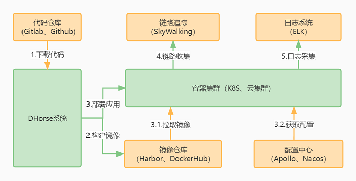

# 项目介绍
DHorse是一个轻量级的云应用管理平台，界面简洁、操作简单，不需要懂容器、k8s的概念，具有多环境管理、应用部署、服务治理、多云管理等功能。

## 主要特性
* 简洁的操作界面
* 以应用为中心，屏蔽K8S的底层概念
* 支持SpringBoot、Vue、React、Nodejs、Html应用部署
* 无需安装Docker即可构建镜像
* 无需安装Maven、Gradle、Node即可打包
* 支持多环境部署
* 支持日志收集
* 支持链路追踪

## 架构
 

# 项目地址

* [GitHub](https://github.com/512team/dhorse)
* [Gitee](https://gitee.com/i512team/dhorse)
* [演示1](http://dhorse-demo1.512.team)
* [演示2](http://dhorse-demo2.512.team)

## 快速开始

1.环境要求

| Java | kubernetes | Harbor |
| :----: | :----: | :----: |
| >=8 | [1.18.x, 1.26.x] | >=2.0.0 |

2.下载安装文件

[最新稳定版](https://gitee.com/i512team/dhorse/releases/download/v1.3.2/dhorse-v1.3.2-bin.tar.gz)

3.解压

```bash
$  tar zxvf dhorse-*.tar.gz
```

4.查看文件列表

```bash
$  cd dhorse-* && ls -l
total 24
drwxr-xr-x 2 root root   115 Oct  6 19:56 bin
drwxr-xr-x 2 root root    48 Oct  6 19:56 conf
drwxr-xr-x 3 root root    46 Oct  6 19:56 lib
-rw-r--r-- 1 root root 11558 Dec 10  2021 LICENSE
-rw-r--r-- 1 root root  5141 Dec 26  2021 NOTICE
-rw-r--r-- 1 root root  1337 Jan 21  2022 README.txt
drwxr-xr-x 8 root root    93 Sep 23 16:09 static
```

5.启动服务

```bash
$  bin/dhorse-start.sh
```

6.在浏览器里输入地址：`http://127.0.0.1:8100`，并输入认证信息：admin/admin，登录之后如下图所示

 

7.最后，关闭服务

```bash
$  bin/dhorse-stop.sh
```

## 了解更多

* [操作手册](https://gitee.com/i512team/dhorse-doc/blob/main/guide/%E6%93%8D%E4%BD%9C%E6%89%8B%E5%86%8C.md)

* [配置文件](https://gitee.com/i512team/dhorse-doc/blob/main/guide/%E9%85%8D%E7%BD%AE%E6%96%87%E4%BB%B6.md)

* [多环境标识](https://gitee.com/i512team/dhorse-doc/blob/main/guide/%E5%A4%9A%E7%8E%AF%E5%A2%83%E6%A0%87%E8%AF%86.md)

* [日志收集](https://gitee.com/i512team/dhorse-doc/blob/main/guide/%E6%97%A5%E5%BF%97%E6%94%B6%E9%9B%86.md)

* [链路追踪](https://gitee.com/i512team/dhorse-doc/blob/main/guide/%E9%93%BE%E8%B7%AF%E8%BF%BD%E8%B8%AA.md)

* [打包说明](https://gitee.com/i512team/dhorse-doc/blob/main/guide/%E6%89%93%E5%8C%85%E8%AF%B4%E6%98%8E.md)

* [运行源码](https://gitee.com/i512team/dhorse-doc/blob/main/guide/%E8%BF%90%E8%A1%8C%E6%BA%90%E7%A0%81.md)

## 社区交流

感谢您的支持和关注，如想了解更多内容，欢迎加入微信群。

 

## 开源许可

本软件遵守Apache开源许可协议2.0，详情《 [Apache License 2.0](http://www.apache.org/licenses/LICENSE-2.0)》。